# ConfigTranslator

<div align="center">


**AI-powered Minecraft plugin configuration translator**  
*Made with ❤️ by Noximity Collective*

[](LICENSE)
[](https://nextjs.org/)
[](https://www.typescriptlang.org/)
[](https://tailwindcss.com/)

[**Live Demo**](https://configtranslator.noximity.com) • [**Support Us**](https://ko-fi.com/noximitycollective) • [**Documentation**](./API_SETUP.md)

</div>

---

## ✨ What is ConfigTranslator?

ConfigTranslator is a **free, AI-powered web application** that intelligently translates Minecraft plugin configuration files while preserving their structure, MiniMessage color codes, and placeholders. Built for the Minecraft community by developers who understand the importance of maintaining plugin functionality across different languages.

### 🎯 Perfect For
- **Server Administrators** managing multilingual communities
- **Plugin Developers** creating international releases  
- **Community Managers** localizing server content
- **Minecraft Networks** expanding to new regions

---

## 🚀 Key Features

<table>
<tr>
<td width="50%">

### 🤖 **Smart AI Translation**
- Powered by GPT-4o-mini via OpenRouter
- Context-aware Minecraft plugin understanding
- Preserves technical functionality

### 🎨 **MiniMessage Support**
- Maintains color codes: `<red>`, `<#FF0000>`
- Preserves gradients: `<gradient:red:blue>`
- Keeps decorations: `<bold>`, `<italic>`

### 📁 **Multiple Formats**
- YAML (`.yml`, `.yaml`)
- JSON (`.json`)
- Properties (`.properties`)
- Config files (`.conf`, `.config`)

</td>
<td width="50%">

### 🌍 **7 Languages Supported**
- 🇺🇸 English • 🇨🇳 Chinese • 🇫🇷 French
- 🇪🇸 Spanish • 🇸🇮 Slovenian • 🇩🇪 German • 🇮🇹 Italian

### 🛡️ **Smart Protection**
- Rate limiting (10 translations/hour)
- File size limits (100KB max)
- Secure server-side API calls

### 🎛️ **Modern Interface**
- Dark/Light theme support
- Real-time progress tracking
- Copy & download functionality

</td>
</tr>
</table>

---

## 🏃‍♂️ Quick Start

### Prerequisites
- Node.js 18+ 
- npm or yarn
- OpenRouter API key (optional, falls back to demo mode)

### Installation

```bash
# Clone the repository
git clone https://github.com/NoximityCollective/configtranslator.git
cd configtranslator

# Install dependencies
npm install

# Set up environment variables (optional)
cp .env.example .env.local
# Add your OpenRouter API key to .env.local

# Start development server
npm run dev
```

Open [http://localhost:3000](http://localhost:3000) and start translating! 🎉

---

## ⚙️ Configuration

### Environment Variables

Create a `.env.local` file in the project root:

```env
# OpenRouter API Configuration (optional)
OPENROUTER_API_KEY=your_api_key_here
NEXT_PUBLIC_SITE_URL=http://localhost:3000
NEXT_PUBLIC_SITE_NAME=ConfigTranslator
```

### API Setup

For AI-powered translations, get your API key from [OpenRouter](https://openrouter.ai/):

1. Sign up at OpenRouter
2. Generate an API key
3. Add it to your `.env.local` file
4. Restart the development server

**Without an API key**, the app runs in demo mode with limited vocabulary.

---

## 🎮 How It Works

```mermaid
graph LR
    A[📁 Upload Config] --> B[🔍 Validate File]
    B --> C[🌍 Select Language]
    C --> D[🤖 AI Translation]
    D --> E[✅ Smart Preservation]
    E --> F[📊 Results & Stats]
    F --> G[💾 Download/Copy]
```

<div align="center">



</div>

### Translation Process

1. **Upload** your configuration file (YAML, JSON, Properties, etc.)
2. **Select** target language from 7 supported options
3. **AI analyzes** and translates only human-readable content
4. **Preserves** all technical elements:
   - Configuration keys and structure
   - MiniMessage color codes and formatting
   - Placeholders like `%player%`, `%time%`
   - Comments and technical identifiers
5. **Download** or copy the translated result

---

## 🛠️ Technology Stack

<div align="center">

| Frontend | Backend | AI & APIs | Styling | Tools |
|----------|---------|-----------|---------|-------|
|  |  |  |  |  |
|  |  |  |  |  |

</div>

---

## 📊 Usage Limits

| Feature | Free Tier | Notes |
|---------|-----------|-------|
| **Translations** | 10 per hour | Resets every hour |
| **File Size** | 100KB max | Sufficient for most configs |
| **Languages** | 7 supported | More coming soon |
| **File Types** | 6 formats | YAML, JSON, Properties, etc. |

---

## 🤝 Contributing

We welcome contributions from the community! Here's how you can help:

### Ways to Contribute
- 🐛 **Report bugs** via GitHub Issues
- 💡 **Suggest features** for new functionality  
- 🌍 **Add language support** for more regions
- 📝 **Improve documentation** and examples
- 🎨 **Enhance UI/UX** with design improvements

### Development Setup

```bash
# Fork the repository
git clone https://github.com/yourusername/configtranslator.git

# Create a feature branch
git checkout -b feature/amazing-feature

# Make your changes and commit
git commit -m "Add amazing feature"

# Push to your fork and create a Pull Request
git push origin feature/amazing-feature
```

---

## 📄 License

This project is licensed under the **MIT License** - see the [LICENSE](LICENSE) file for details.

---

## 💖 Support

<div align="center">

**Love ConfigTranslator?** Help us keep it free and improve it further!

[](https://ko-fi.com/noximitycollective)

*Your support helps cover API costs and enables new features*

</div>

---

## 🔗 Links

- **📧 Contact**: [hello@noximity.com](mailto:hello@noximity.com)
- **🐙 GitHub**: [@NoximityCollective](https://github.com/NoximityCollective)
- **☕ Support**: [Ko-fi](https://ko-fi.com/noximitycollective)

---

<div align="center">

**Made with ❤️ for the Minecraft community**

*ConfigTranslator • © 2024 Noximity Collective*

</div>
